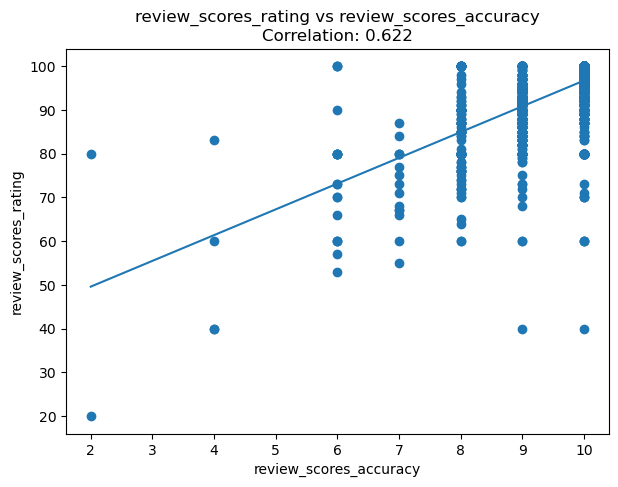
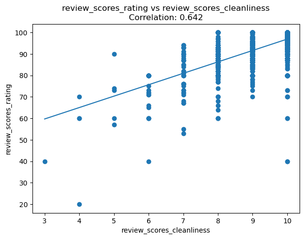
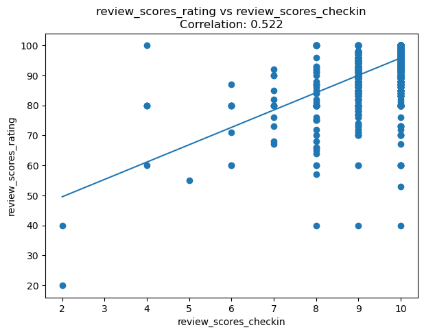
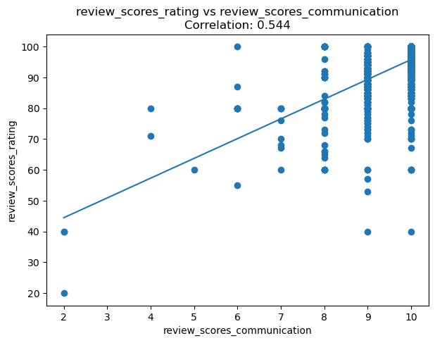
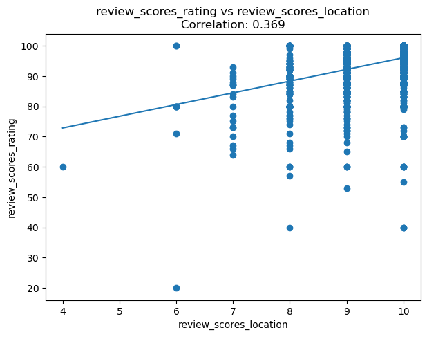
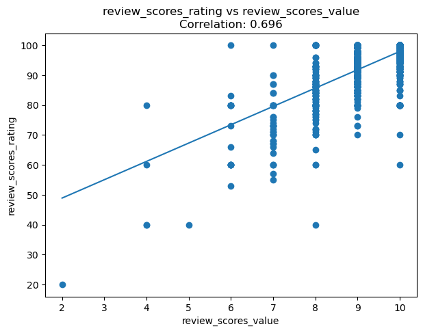
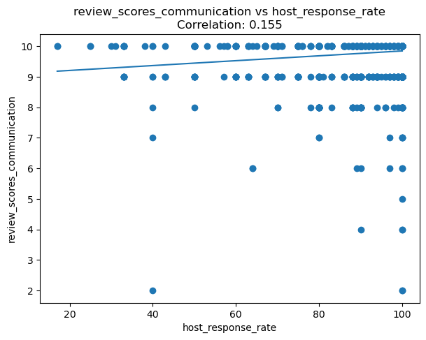
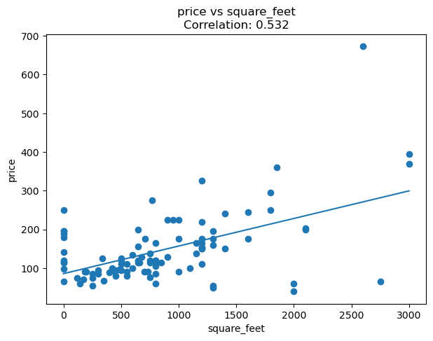

# Introduction
I am seeking to understand the Seattle market for Aribnb and what factors contribute to the overall rating of each listing. As a potential Airbnb owner, this information will be useful for me to determine where I should put my energy and resources. I pulled the data from https://www.kaggle.com/datasets/airbnb/seattle/data. I compared the overall rating for the listings to each of the rating categories: listing accuracy, cleanliness of the Airbnb, ease of the check-in process, communications, location, and the value of the Airbnb. Further, I will examine whether the response rate of the host would affect the communications rating. Lastly, I want to determine if I put money on a bigger house would generate a bigger listing price. 

# Part I: Overall rating vs sub-ratings 
First up is the overall rating compared to the listing accuracy. From the graph below, we can see a correlation coefficient of 0.622, which is moderate. I'd say listing accuracy is somewhat important to guests.  

Next, we will look at the overall rating compared to the cleanliness of the property. From the graph below, we can see a correlation coefficient of 0.642, which is also moderate. I'd say the listing accuracy is somewhat important to the guests as well.  

Third on the list, we have the overall rating compared with the check-in process. The correlation coefficient is 0.522, still moderate, but lower than the previous too. Relatively speaking, the checking process is less important compared with the accuracy of the listing and the cleanliness.  

Next, we have overall rating compared with communications. The correlation coefficient is 0.544. Similar story as cleanliness.  

Next, we have overall rating compared with location. This is the lowest we have one the list at 0.369. It appears that the guests don't really care about the location as compared with other categories.  

Lastly, we have overall rating compared with value. This has the highest correlation coefficient. It seems that value is very important to guests.  

# Part II: Host's response rate vs the listing's communication score
The next question is does the host's response rate affect the communication score? If I can get away with it, I don't want to be 24/7 on my phone standing by to cater to every little detail of the guests. It looks like was have a very weak correlation, at 0.155, between response rate and communication score. This is good news! I can sleep early at night without worrying that if I answer the guest the next morning, I will get a low communications score.  

# Part III: Size of the property vs price 
The correlation between the property size and the price I can list the property for is moderate at 0.532. The bigger the house doesn't necessary mean I can always ask for more money.  

# Conclusion
There's a moderate to high correlation between value of the rental, cleanliness, and accuracy of the listing to the overall rating. There's a moderate correlation between the check-in process and communication to the overall rating. There's a weak correlation between the location of the listing to the overall rating. Also, there an extremely weak correlation between the host's response rate to the communication score. As expected, there's is positive moderate correlation between the square footage of the listing to the price. 
